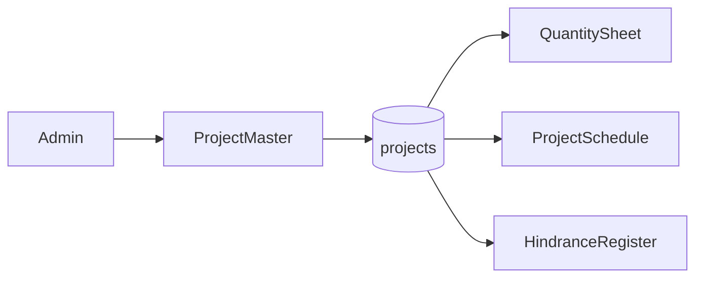

# Final PRD (corrected information architecture)

## Forms (not a nested Project module)

There is **no** Project Tracker / Project parent with child pages. Working users see **three peer forms** in MODULES, same level as today:

- **Quantity Sheet** — already exists ([qs_home_screen.dart](flutter_app/lib/screens/quantity_sheet/qs_home_screen.dart)); keep its internal tabs (Data Entry, View, Compare, Overruns, Setup).
- **Project Schedule** — one screen: grid + Gantt (no extra routes for creating an activity).
- **Hindrance Register** — one screen: list + create/edit dialog.

Admin also has a fourth form, not in MODULES:

- **Project Master** — Administration, **admin role only**. Creates/edits/archives sites.

Sidebar shape:

- MAIN: Dashboard
- MODULES: Report Transformer, Quantity Sheet, Project Schedule, Hindrance Register
- ADMIN: User Management, Project Master (admin only)

Remove the unused `project_tracker` “Soon” item in [nav_destination.dart](flutter_app/lib/layout/nav_destination.dart). Do **not** add Overview as a fourth working form.

Each of the three working forms has its **own project dropdown** (active projects only). Incomplete/empty: “No projects yet. Ask an administrator to create a project.”

## Access

- Project Master UI + write APIs: `role.name == "admin"` only (not a checkbox for other roles).
- Quantity Sheet: existing module `quantity_sheet`.
- Project Schedule: new module `project_schedule`.
- Hindrance Register: new module `hindrance_register`.

A PM role can be given any combination of the three working modules. Schedule and hindrance are independently grantable, same pattern as [modules.py](backend/app/services/modules.py) and [kModuleLabels](flutter_app/lib/services/users_api.dart).

## Project Master (unchanged intent)

- Fields: name (required, unique), optional code / location / client, status active|archived.
- Archived hidden from working dropdowns.
- Greenfield `projects` table. Dummy SQLite may be deleted; **no data migration**.
- QS Setup: **remove** add/delete project ([qs_setup_tab.dart](flutter_app/lib/screens/quantity_sheet/qs_setup_tab.dart)). Keep floors + QS activity catalogue. 403 or remove `POST`/`DELETE` on `/api/quantity-sheet/projects`.
- `GET /api/projects` shared by all three forms.

## Project Schedule (peer form)

Columns: activity name, COD, days, start date, dependency, quantity, unit.

- Draft last row; **POST only when required fields are complete** (name, COD, days, start). Dependency / qty / unit optional.
- Calendar days; `finish = start + days - 1`; FS links + optional lag; server recalc; reject cycles.
- One page: frozen grid + synced Gantt. Mobile: Table | Chart toggle on the same screen.

## Hindrance Register (peer form)

Own nav destination and screen. CRUD for the selected project: type, description, optional linked schedule activity, from/to, delay days, open/closed, remarks, raised by. Does **not** auto-shift the Gantt in v1.

Hindrance may still **reference** a schedule activity (`activity_id` nullable). If the user has hindrance but not schedule, the activity picker is empty or read-only names from API.

## Data and APIs (implementation when you approve)

- `projects` replaces `qs_projects` as FK parent for QS tables and new `pm_activities` / `pm_activity_links` / `pm_hindrances`.
- `GET/POST/PATCH /api/projects` (+ archive) with `require_admin` on writes.
- Schedule router `/api/project-schedule` gated by `project_schedule`.
- Hindrance router `/api/hindrance-register` gated by `hindrance_register`.
- Flutter: two new screens + two API clients; wire [app_shell.dart](flutter_app/lib/layout/app_shell.dart). Quantity Sheet switches project list to shared `ProjectApi`.

## Out of v1

Working calendar, SS/FF/SF, critical path, hindrance applying delay, per-user site assignment.
